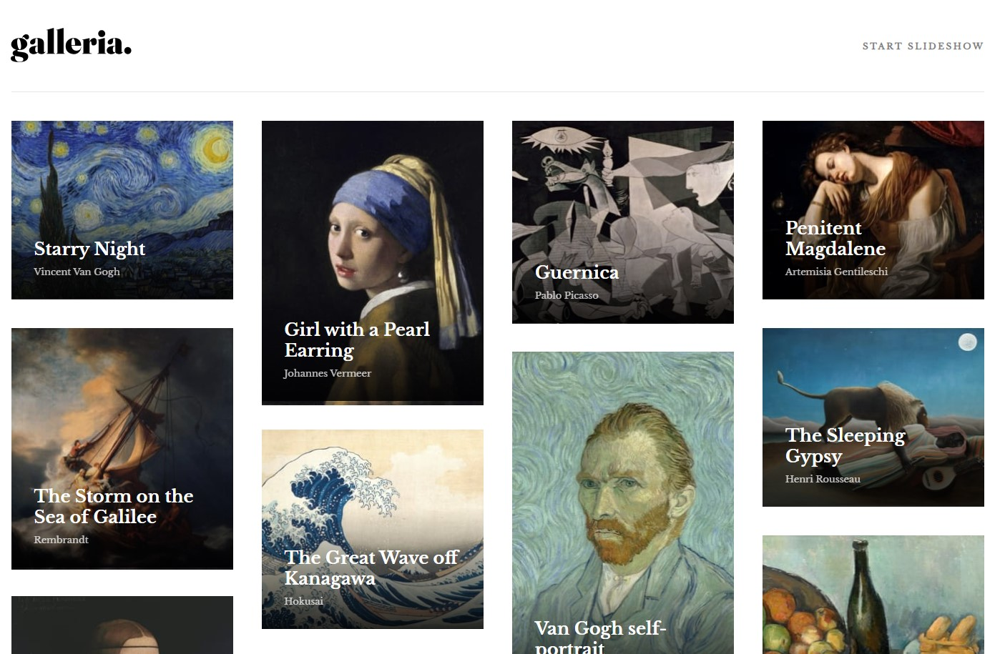

# Frontend Mentor - Galleria slideshow site solution

This is a solution to the
[Galleria slideshow site challenge on Frontend Mentor](https://www.frontendmentor.io/challenges/galleria-slideshow-site-tEA4pwsa6).
Frontend Mentor challenges help you improve your coding skills by building
realistic projects.

## Table of contents

- [Overview](#overview)
  - [The challenge](#the-challenge)
  - [Screenshot](#screenshot)
  - [Links](#links)
- [My process](#my-process)
  - [Built with](#built-with)
  - [What I learned](#what-i-learned)
- [Author](#author)

## Overview

### The challenge

Users should be able to:

- View the optimal layout for the app depending on their device's screen size
- See hover states for all interactive elements on the page
- Navigate the slideshow and view each painting in a lightbox

### Screenshot

### Links

- Solution URL:
  [https://github.com/Wojtek-A/galleria-slideshow-site-frontend-mentor]
- Live Site URL:
  [https://wojtek-a.github.io/galleria-slideshow-site-frontend-mentor/]

## My process

### Built with

- [React](https://reactjs.org/) - JS library
- Vite
- Mobile-first workflow
- Semantic HTML5 markup
- CSS custom properties
- React Responsive Masonry
- Modern normalize

### What I learned

createContext, useContext from 'react'

## Author

- Frontend Mentor - https://www.frontendmentor.io/profile/Wojtek-A/
- GitHub - https://github.com/Wojtek-A/
